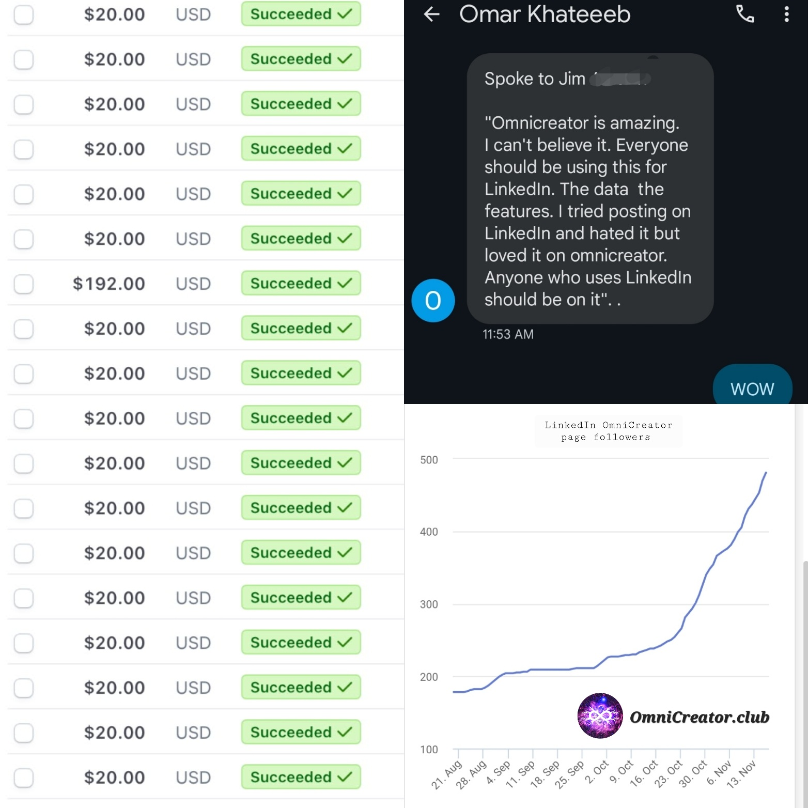

(In the last 15 years, I have been keeping my journal at the end of each year
since my birthday is in December. I do so in Japanese, my mother language, so
I can fully express my thoughts. Below is a machine translation by
[DeepL Translator](https://www.deepl.com/translator), and I edited it a little
where it sounded very awkward. This year has been great learning, and
I hope you read my journal and share your thoughts with me. If you understand Japanese, please read the [original](https://www.daigotanaka.com/ja/48-years/).)

+++

! [Tahoe Ski Trip](... /images/tahoe-ski-trip-2023.jpg) /images/tahoe-ski-trip-2023.jpg)

My birthday has passed without incident this year.
However, I had a bad sciatic nerve pain in November, and it was the end of the year when I had to take a break from hiking and jogging, which I like, to concentrate on the treatment.
I am writing this diary while resting my back in bed.

I would like to share my experience with solopreneurs and scalable lifestyle businesses.

## Forming a new company with my best friend

The best thing that happened to me at work this year was creating a new product and forming a company with my friend Omar...

! [Two Sea Lions Inc.](. /images/omar-daigo-two-sea-lions.jpg)

but the company was created almost immediately in September.
I'd like to summarize how something that was not even a shadow of a shadow at the beginning of the year came to be in the blink of an eye.

It was a year ago that I, an engineer, and Omar, a marketing specialist, agreed to work together on a project.
Omar had been inspired by me to start his own business, and he was just getting his business off the ground.
The term "solopreneur" is used. Solopreneur" is a combination of the words "solo" and "entrepreneur," and refers to those of us who start and run our own businesses on our own.
Omar and I are both solopreneurs. It is an experiment to see what can be done when two people who are independently earning money in different fields of expertise cooperate.
I make the products and he sells them.

The name of the company is Two Sea Lions Inc.
I came up with it on the spur of the moment.
The photo above was taken when I visited Omar in San Diego at the end of the summer.
While eating at Georges at the Cove restaurant overlooking La Jolla Beach, I saw a large sea lion gracefully lounging on a rock on the beach, oblivious to the divers and tourists nearby.
The sight of this unassuming creature reminded me of two solopreneurs who are doing their own thing.
That is the origin of Two Sea Lions.

## Riding the wave of personal branding and social selling

Before launching Two Sea Lions, Omar and I created OmniCreator ([OmniCreator.club](https://omnicreator.club)), a membership service on LinkedIn that provides the tools and community to become a trusted professional. He created a membership service.

[! [OmniCreator](. /images/omnicreator-landing-page.jpg)]](https://omnicreator.club)

LinkedIn is an important social network for American solopreneurs to develop customers and generate sales.
Centered on LinkedIn, social selling is becoming an important keyword not only for solopreneurs but also for marketing and sales in large companies.
The key to this is the dissemination of information from personal accounts.
This was news at the end of last year when IT giant Cisco announced that it had begun training 84,000 employees to send out information via LinkedIn.
It is gradually becoming recognized that sending information from an employee's personal account is more likely to attract sympathy and propagate than sending information from a corporate page.

Omar has 34,000 linked-in followers in the medical device sales field. I have one-tenth of that number of followers in the engineering field. Both he and I post useful information and personal stories to our followers every day. By having our profile pictures and names appear daily on the timelines of those we connect with, and by talking about our areas of expertise, we have two effects. One is a greeting effect on existing customers. The other is to have potential customers associate our faces and names with our areas of expertise and keywords in their minds.

The timeline of LinkedIn users is full of various posts. So we need to create compelling content that stops their scrolling fingers. Individual LinkedIn posts reach only a high percentage or 10% of all followers. Therefore, you need to repeat the same message every day. OmniCreator provides the tools to schedule daily content that will grab attention and be useful to everyone.

Individuals post to LinkedIn for a variety of reasons. They can become well-known in their field of expertise to get a better job or career opportunity, sell educational content, or become an independent consultant. Some sales professionals also use LinkedIn to expand their network and help in their sales activities. Some professionals and doctors use it to enhance their own brand. OmniCreator started as a content creation tool, but has grown into a supportive community of people working hard for the same goal. There is a saying in online product development, "Come for the tool, stay for the network." We want to realize this in the form of a community.

## From the birth of the product to its billing

Having earned a PhD in the US, worked for a large company, built a product from scratch in a startup, and started my own company, I have a full set of methods for getting an idea for a digital product and giving it shape. It is not a set of rules, but rather my own way of doing things, but I would like to summarize the process.

As an engineer, I would like to describe the general flow of creating a digital product. 1,

### 1. Create what you want

I don't want to lose my effort, so I try to make something that I will use. The idea comes to me when there is no existing tool to make my work more efficient or when I am not satisfied with the existing product. At this stage, it is enough if only I can use it. If you make something for yourself, even if the project stops here, you will still have the satisfaction of having made something useful yourself and learning from it. 2.

### 2. Ask a friend to try it
If you want people to use it, you need to make it into a web application or create an account so that they can log in. After painstakingly making it available to others, you introduce it to your friends. Most of your friends will like it, but don't believe them. They say it's good, but they don't use it repeatedly, and that's where the real story lies. That's why we measure who is using our services and when they are using them. We also measure the time it took from sign-up to completion and realization of value.

Where are the people who have the same needs as you, and who will use the software? And even if you think you have designed your software to be intuitive, you will discover that there are many parts of the software that cannot be used without explanation. 2. realize that it takes many times more effort than in step 1 to bring the software to a level of perfection that will allow people other than yourself to use it.

### 3. Recruit initial free users

After you have squashed all the problems and bugs based on the feedback you got in step 2, reach out to more people. Remember, even though it is free, you are asking people to give you their time to try out a product that has no reputation or anything else.

At this stage, find someone other than a friend who might be an ideal customer and ask them to try it out. So you have to introduce yourself and briefly tell them what it can do for them. As in step 2, measure usage and speedily respond to areas that can be improved by asking about usage. Make an effort to interact and respond to users via e-mail, chat, etc. so that they do not lose interest, and get a favorable impression of the site. Once you have gained a small number of fans, you can introduce them to the site in the words of your customers. 4.

### 4. Start billing

Calculate the cost of acquiring users and managing their accounts. If you cannot cover those costs and make a profit, you are not in business. Is it possible to lower the cost? Or, can you increase the value of the service so that you can charge a higher fee? How much do other similar products cost? Is it possible to raise the price by narrowing down the target clientele and creating a sense of luxury? Taking these factors into consideration, decide on a billing structure and price, and try to recruit paying users.

At this point, again, do not advertise or launch a flashy product, but search for at most a few dozen users with your feet, and continue dialogue and improvement as in step 3. At the same time, learn what it is that your target customers desire beyond superficial features, and reflect that in your copywriting. If you don't sharpen your copy and present the joyful feedback from the initial users, it will be difficult to increase usage. If you run ads before that is solidified, you will fail to get to the point of billing. The order should be firmly adhered to: first, increase the level of perfection with a limited number of users, and then expand marketing and sales activities. 5.

### 5. Succeed in continuous billing

In the case of online tools, so-called SaaS (software-as-a-service), after a free period of about one month, customers enter their credit card and start paying monthly. The first few months are critical, and if during this time they feel that the service is "useless" and leave the company, it will be a failure. You must continue to communicate the value of your service to your users through emails and in-app content, based on their level of understanding. 6.

### 6. Gaining Word of Mouth

The most effective sales channel is word of mouth. Customers must love you because of your highly perfected products and great support. Customers who love you know similar types of people. Ask them to put you on the topic of conversation with those people. Also, create incentives for referrals through systems such as referral-based fee reimbursement and affiliate programs.

Choosing the right fishery is also important. If you deal with the entire market from the beginning, it will not work. It is more effective to find places where people of a certain country, industry, profession, age, or other commonalities are gathering and conversing, and concentrate your efforts on them. This is because within a small group, if someone influential is using it, or if many people are using it, it is easy to say, "Well, then, so am I.

## Scalable Lifestyle Business

By following the above steps carefully and without haste, monthly sales have stabilized, although still small. The number of followers on the product's LinkedIn page has also increased and we have received a lot of good feedback.

Omar and I, each earning income from our separate businesses, launched the OmniCreator project without hiring anyone and with limited time and a minimal budget. We do not need to bring in outside funding in the future.

What we want to pursue is a scalable lifestyle business.

The evolution of the cloud environment over the past decade has been remarkable. One full-stack engineer is all that is needed to develop new services from experimental deployment to billing. More and more businesses can be created without having to go through the process of raising funds from venture capitalists and angel investors, hiring people, and finally launching the business, as has been the case until now. By not bringing in outside funding, keeping costs low, and focusing on billable potential from the outset, businesses can grow gradually at their own pace without overworking themselves.

At a minimum, I only need someone to make, sell, and provide customer support. I can create, but I am not good at selling. Fortunately, I was able to team up with my good friend Omar, who is independent in his ability to sell. Omar and I will be like sea lions on La Jolla Beach, slowly building a business next year that will scale beyond my time while putting my family and my lifestyle first.

The year 2023 was the first year that generative AI through chat GPTs began to accelerate the creative activities of ordinary people. AI will do the programming and marketing, with a single human in a supervisory role. Such a future is already here. The groundwork for a successful scalable lifestyle business has been laid. We believe that more and more people will succeed in scalable lifestyle businesses as an alternative style to the startup boom with large scale funding that has lasted for 15 years since 2007.
